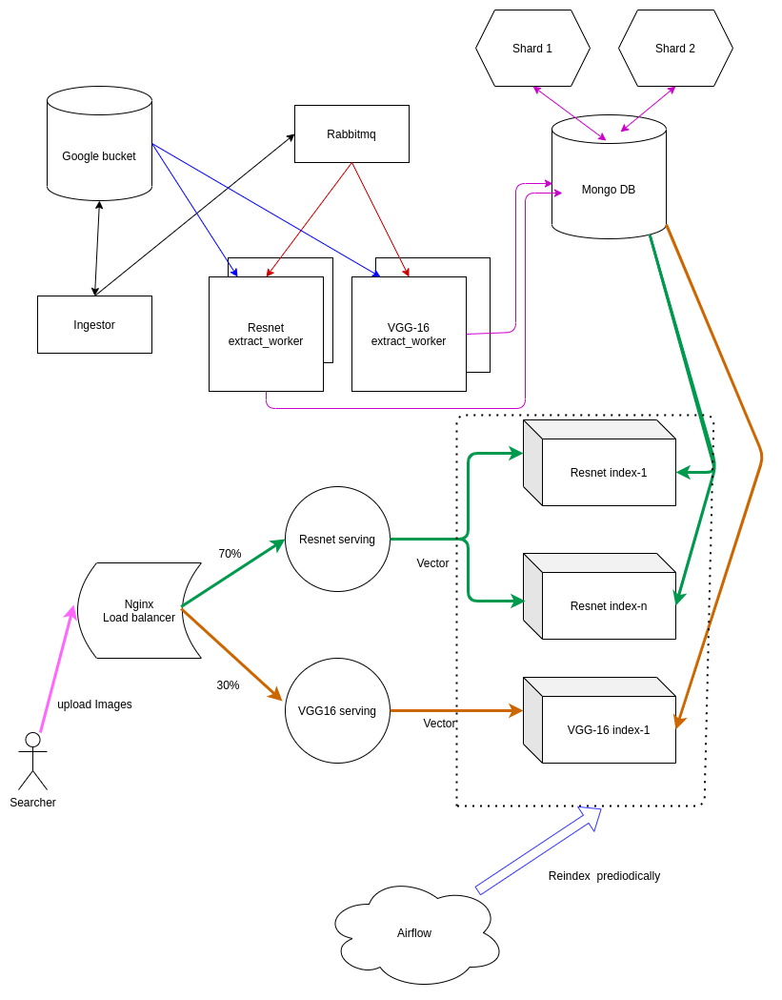

# Elastic image search 

Project Report
Author: Anh Nguyen 

ha.a.nguyen@aalto.fi

CS-E4660 - Advanced Topics in Software Systems, 09.09.2020-02.12.2020

## Objectives
* Practice ML serving for image search problem
* Design and implement a horizontally scalable image search micro services 
* Build a general image search framework that allows changing Tensorflow ML models easily
* Practice benchmark and monitoring 

## Technologies
* Openshift running on Rahti CSC cloud
* Tensorflow: ML framework 
* Scikit-learn: Vector clustering, search
* Rabbitmq: Message queue
* MongoDB: Document-origiented database
* Prometheus: Monitoring tool
* MLFlow: ML experiment tracking and metrics visualization tool

## Architecture:


## Demo links: 

* http://serving-mongo.rahtiapp.fi/
* http://serving-resnet-mongo.rahtiapp.fi/
* http://serving-mobilenet-mongo.rahtiapp.fi/
* http://serving-custom-mongo.rahtiapp.fi/

## Project structure
```bash
elastic-img-search/
└─── README.md
└─── extract_worker/    # Download images from Bucket and convert to vectors 
└─── extractors/        # Web server to search 
└─── index/             # Load vector from db and cluster
└─── config/   # source code
    │
    └─── config.json    # Deployment configuration file (ml model, scale) 
    └─── deploy.py      # Parse configuration files and deploy on Openshift 
    └─── templates/     # Kubenetes template files, scripts
    │
    └─── K8s/           # Final configuration files to deploy
```

## Configuration declaration:
Configuration has 2 parts: `models` (general metadata of models which can be referred to in services) and `services` (metadata of each services).
```json
{
  "models": [
    {
      "name": "resnet"    # Pretrained TF model 
    },
    {
      "name": "mobilenet" 
    },
    {
      "name": "custom",
      "model_url": "https://storage.googleapis.com/images-search/model-finetuned.h5"  # Add custom model to the system
    }
  ],
  "services": [
    {
      "name": "extract_worker",
      "models": [
        {
          "name": "resnet",
          "pods": 4       # num pods 
        },
        {
          "name": "mobilenet",
          "pods": 1 
        }
      ]
    },
    {
      "name": "indexing",
      "models": [
        {
          "name": "resnet",
          "num_indexes": 2, # Create 2 index servers, each load half db
          "pods": 5,
          "index_algorithm": "brute" # Clustering algorithm
        },
        {
          "name": "mobilenet",
          "num_indexes": 1,
          "pods": 1 
        },
        {
          "name": "custom",
          "num_indexes": 1,
          "pods": 1
        }
      ]
    },
    {
      "name": "serving",
      "models": [
        {
          "name": "resnet",
          "pods": 20 
        },
        {
          "name": "mobilenet",
          "pods": 1 
        },
        {
          "name": "custom",
          "pods": 1 
        }
      ] 
    },
    {
      "name": "nginx",
      "pods": 1,
      "serving_weights": [
        {
          "name": "resnet",
          "weight": 1  # weight to load balance between services
        },
        {
          "name": "mobilenet",
          "weight": 1
        },
        {
          "name": "custom",
          "weight": 1
        }
      ]
    },
    {
      "name": "rabbitmq_wrapper",
      "pods": 1
    },
    {
      "name": "rabbitmq",
      "pods": 2 
    },
    {
      "name": "prometheus",
      "pods": 1 
    },
    {
      "name": "mongo",
      "services": [
        {
          "name": "config_db",
          "pods": 3
        },
        {
          "name": "router",
          "pods": 3
        },
        {
          "name": "shard",
          "shards": 2,
          "pods": 3
        }
      ]
    }
  ]
}
```
To deploy/redeploy to OpenShift, please use the command:

```bash
cd configs && python3 deploy.py
```

## Run prototype locally with Docker-compose
Run the prototype with
```bash
docker-compose up --build
```

## Design docs:

* When `configs/deploy.py` is run, the metadata in `configs/config.json` is mapped to generate the Kubernetes `.yml` files and some scripts files such as `mongo_shard.sh` to set up the server.
* Those generated config files are first stored in the `configs/staging` directory to compare the diff with the currently running config files in `configs/K8s`. Once the diff is computed, all services are updated based on the files in `configs/staging`. Then all files in `configs/staging` are moved to `configs/K8s` dir.
* Then, we need to run a few additional scripts to connect some services (create db replica, sharding)

## Workflow:
There are 2 parts of the whole process:
### 1. Ingesting: 
* The script `ingestor/ingestor.py` is used to upload files to Google Cloud Bucket and get the url of the objects.
* The url is then sent to the web service `rabbitmq_wrapper` via HTTP. This server is a workaround since Openshift does not support exposing TCP/IP protocols to outside network. Hence, we can't expose Rabbitmq or Mongodb directly from Openshift.
* The url is next sent to a `fan-out` exchange in Rabbitmq so that every queue (each corresponds to each model in the system)
* Then a set of `extract_worker` pods takes the image url from queue of each models and download those images. Next, workers extract vectors from those images and insert the whole vector to `Mongodb`. I chose `Mongodb` because I need to store vector (number array in different size), which is suitable for NoSQL Database. In addition, the automatic sharding mechanism is ideal for horizontal scaling.
* Each model stores data in separate db collection. The index servers load the whole db at once. We allow adding multiple index servers for sharing the load and horizontally scalling. For example, if we have 8000 vectors in the db and 2 index service for model `Resnet`, each service will load 4000 vectors to memory.
* The data loaded to memory is then clustered using `k-NN` algorithm `(sklearn.neighbors.KNeighborsClassifier)` and keep in memory for fast searching. Since we don't want to load the database for every search request and we don't need to update the existing vector, this allows fast searching. 
* What if the loaded data is stale? We need to update the index periodically using a manual script or run Airflow task for to schedule reindexing process. Loading index data from db takes roughly 2-3 seconds for 8000 imanges 

### 2. Searching:
* The user and submit the `POST` request to the web server (either directly to each specific model or through load balancing via `nginx`). We can assign weight for each web server behind `nginx`. While Openshift does has configurable HA Loadbalancing, they only allow **maximum 4 services**. Notice that there is no maximum number of load-balanced replica pods in each service (For example, service `resnet` has 100 pods that can be load-balanced by default in OpenShift). However, we can only load-balance 4 difference services (E.g: "resnet", "mobilenet", "vgg16", "vgg19").

* Web-server converts image to feature vectors using the same model as `extract_worker`. Hence, the vector generated by the same model has the same length.

* Each web-server knows how many indexing service that it has to fetch data from based on the metadata in the file `configs/config.json`. Hence, this is similar to the approach "Infrastructure as code", in which code and configuration dictate the relationship, behaviors between services.

* Each index server receives request and find the top X results that are closed to the query vector and return the score, image url to the web-server. This step can be solved using either bruteforce or hierachical clustering such as `Kdd_tree`. The web server then gather the results of each index, aggregate the results to generate the final X results.

# What is good about this demo project:

* The system is built with micro-services connecting to each other via message broker and rest api. Which is quite flexible in terms of change in each component. Adding new Tensorflow models requires adding url of the model in the config file, change a few parameters, reconverting images to new feature vectors, then dumb to db, index and serve. With the help of Load balancers and Kubernetes, we can change model in roll-out fashion.
* A centralized configuration file which acts as a single source of truth for setting up the servers, service discovery in declarative ways. This can help the observability and reasoning when problem arises.
* Using observability tools such as prometheus and MLFlow to track and analyze the bottleneck in the system.

# What could be improved:

## Scalability:
* This system is horizontally scalable by adding more pods to distribute the load. However, the hardest problem at this scale comes from the part that needs vertical scaling. For example, if the search request take 1s in total, 0.8-0.9s is spent on converting image to vector and the rest for networking + search. In this particular demo, we also have constraints in the total number of CPU for each pod (1.6 vCPU). Hence, each server pod can barely handle 1 request at a time and it consumes 6Gb of Ram and 1.6 CPU just to handle 1 concurrent request for some large models(vgg19). The engineering mistake that I made here is that I put the logic for model computing, which is CPU-bound in this demo in the webserver. This seriously chokes the server due to the Global Intepreter Lock(GIL) in python. To mitigate the problem with GIL, multiprocessing(spawned new processes to handle concurrent requests) is used to alleviate the problem (Unfortunately, we have the quota of 1.6 vCPU, which doesn't bring much improvement in this case). Therefore, the system can only be scaled by adding more pods (the maximum quota is 50 but we need around 20 to run other services which leaves the remaining 30 for web-server)
### Potential solutions:
1. Using `gunicorn` web servers to spawn workers. Using threads, gevent doesn't help much with the CPU-bound task here due to Python GIL, adding more processes can circumvent the GIL problem. More information [here](https://medium.com/building-the-system/gunicorn-3-means-of-concurrency-efbb547674b7).

Adding the additional worker does help increasing throughput slightly. However, it does add complexity when dealing with memory since each process has its own memory space. For example, imagine that you have to send a request to a service A at `http://a.fi/load-index` to update the data in memory of the server. However, there are 2 servers(processes) that stand behind the load balancer at `http://a.fi/load-index` and your request is routed to the first server, leaving the data in the second server staled. This is exactly the bug that I had when trying to update memory of the index server(2 gunicorn worker processes).

2. A better architecture: Using serverless (AWS Lambda, Google Cloud Function) which spins up container for each request in order to convert the image to feature vector since it takes roughly a few seconds at most for processing 1 image. In the python web server, we use gthread of unicorn in order to send request to the serverless function since it is lightweight so it can handle I/O task well. This approach allows us to handle more concurrent requests with the web server while the expensive computation is handled by the cloud function. 

3.Perhaps using GPU or higher-frequency CPU could help to processing image with ML model faster. 

4. Use model that are less expensive (for example, `mobilenet` is 6-7 times faster than `Vgg-16` or 2-3 times faster than `resnet`) but provide lower accuracy as a tradeoff(decreasing precision by half).

## Resiliency:
* System resiliency can be achieve by monitoring and logging to detect bottlenecks (the web server in this case). Kubernetes allows certain level of availability by restarting pod if it crashes. Unfortunately, The auto scaler of Openshift Rahti cloud doesn't work at all so we need to develop some sorts of monitoring and autoscaler by ourselves.
* However, the problem is that there is no deduplication mechanism in the system. This could cause the problem because no one wants to look for an image and discover 100 identical images.
### Potential solutions:
* I have thought about this problem and an initial solution is to deduplicate at the time of ingestion. However, it is hard to do in the context of distributed system (multiple workers can process duplicated images at the same time and insert to db without knowing each other). Hence, one solution is probably running an Airflow job that pull the data from db and perform deduplication. This approach could work since it doesn't disturb the main flow of the data as we don't read db that often thanks to the in-memory indexing.

## Other minor issues:
* Openshift doesn't allow external traffic going to Rabbitmq and Mongodb directly. The workarounds is to interact with Rabbitmq and Mongodb from internal service or expose a wrapper HTTP server to interact with those services. For example, I added a server just to send message from external to Rabbitmq.
* You need to mount Persistent volume to container to write file in container even if those files are just temporary. This could be problematic for applications that need to write config file to some locations that already contains other configuration files. This means that if you mount the volume there so that the application can write configuration, all other existing configuration files stop existing at mount time.
* Normal users don't have permission to create Cluster Admin RBAC in CSC. This could be a problem for service discovery such as when running `prometheus` or `fluentd`. The workaround is to extract Kubernetes data from outside the cluster, generate `ConfigMap` to mount config into the container.  
* CSC Rahti cloud has problem with the limited image pulling rate for Dockerhub. The solution is to use other Image registries such as Google Cloud.

## Lesson learned:
* It takes a huge amount of engineering efforts to bring an existing ML model to production. Often we have to deploy the model in constrained environments, which doesn't work well with complex models since they typically requires more computing resources.
* Put more focus on the elasticity of the system. It includes 2 parts: scalability and replaceability of components in the system.
* Put more focus on the observability of the system early since it will pay off along the way. For example, track metrics, add logging and other observability measures early to save time when triaging problems. You can learn a lot from the metrics collected as the data does have tremendous influences on the architecture of the system. For example, if I detected the problem with the web layer early, I would had more time to switch to serverless for feature extraction.
* Use orchestration as Airflow to schedule the execution of tasks in a systematic way.
* Use proper web server such as gunicorn for Flask web application in production.
* Avoid putting heavy task on the web layer. I should have created a different service for feature extraction.
* Use tools for tracking experiment such as MLflow, which can ease the process of doing experiment.
* Parameterize application as much as possible to make it easy to automate the experimenting process.
* CSC Rahti Cloud with Openshift is cheap and easy to use for academic purposes. However, it does have some problems (Limited pulling rate for images from Dockerhub, limited Cluster Admin RBAC permission).